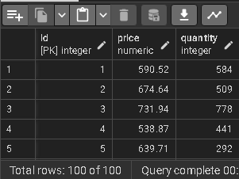

# Database real simulator of buys.

### About project

This project is focus in create a real representation of clients that buy products.

### How does it work?

Functions and procedures is are created that its will execute the logic to insert the rows through loop's that will select random values between cliets.

#### For example

```sql
-- procedure.sql
CREATE OR REPLACE PROCEDURE insert_products() AS $$
	DECLARE
		rnd_quantity INTEGER;
	BEGIN
		FOR i IN 1..100 LOOP
			rnd_quantity := (RANDOM() * 1000) + 1;
			INSERT INTO products (price, quantity) VALUES ((SELECT get_random_price()), rnd_quantity);
		END LOOP;
	END;
$$ LANGUAGE plpgsql;

-- functions.sql
CREATE OR REPLACE FUNCTION get_random_price() RETURNS decimal AS $$
	DECLARE
		min_value DECIMAL := 10.00;
		max_value DECIMAL := 1000.00;
		result DECIMAL;
	BEGIN
		result := RANDOM() * (max_value - min_value) + min_value;
		return ROUND(result, 2);
	END;
$$ LANGUAGE plpgsql;
```

This procedure will insert 100 rows with random price and stock values for each product.

This procedure will result in:



### Tables used


```sql
DROP SCHEMA IF EXISTS public CASCADE;

CREATE SCHEMA public;

CREATE TABLE IF NOT EXISTS clients (
    id SERIAL NOT NULL,
	...
);

CREATE TABLE IF NOT EXISTS products (
    id SERIAL NOT NULL,
	...
);

CREATE TYPE enum_status AS ENUM (
	'Pendiente',
	'Enviado',
	'Entregado'
);

CREATE TABLE IF NOT EXISTS orders (
    id SERIAL NOT NULL,
	...
	CONSTRAINT fk_client_id FOREIGN KEY(client_id) REFERENCES clients(id)
);

CREATE TABLE IF NOT EXISTS orders_details (
    id SERIAL NOT NULL,
	...
	CONSTRAINT fk_order_id FOREIGN KEY(order_id) REFERENCES orders(id),
	CONSTRAINT fk_product_id FOREIGN KEY(product_id) REFERENCES products(id)
);

CREATE TYPE payments_method AS ENUM (
	'PayPal'
);

CREATE TABLE IF NOT EXISTS payments (
	id SERIAL NOT NULL,
    ...
);
```